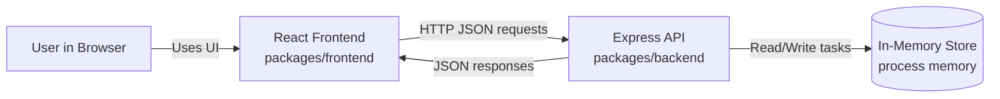
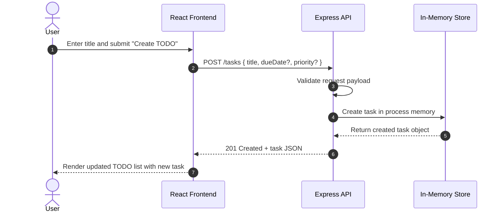

# Cloud Architecture Overview

This monorepo uses a simple local architecture suitable for MVP development.

## System Context

## Sequence: Create a TODO

## Notes

- The frontend is a React single-page application.
- The backend is an Express API running in the same repository.
- Data persistence is in-memory for runtime only; data resets when the backend restarts.
